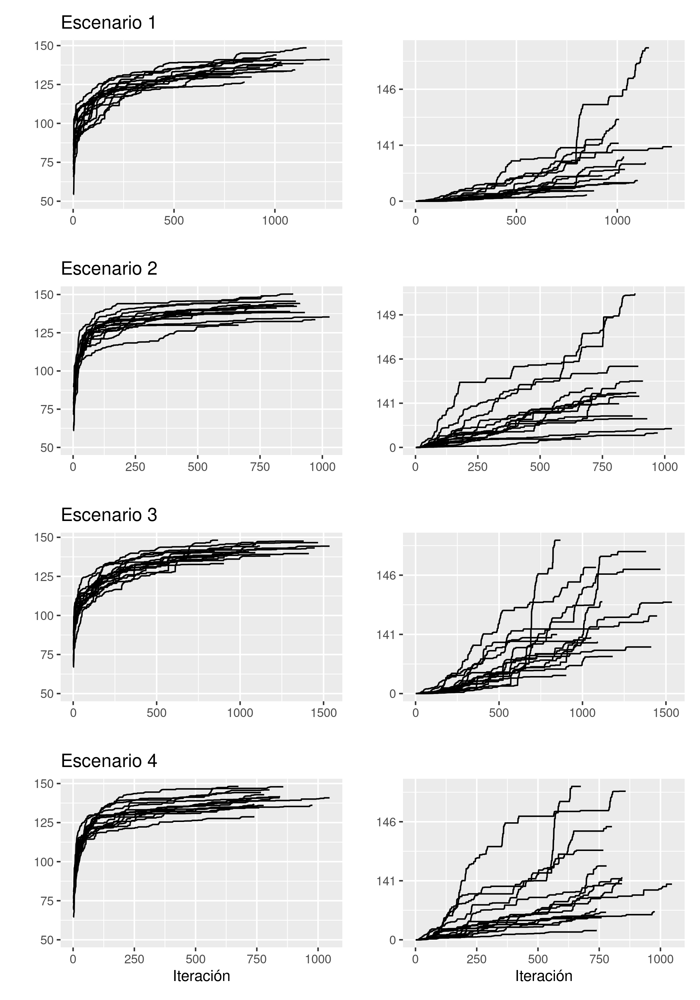
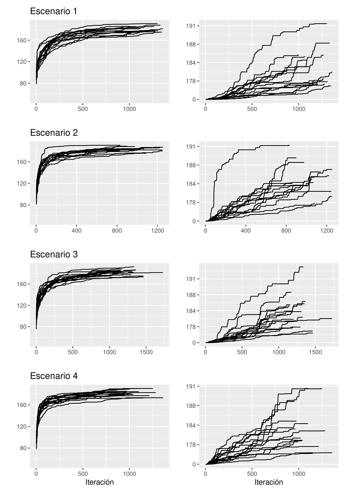

```{r setup, include=FALSE}
knitr::opts_chunk$set(echo = TRUE)
```


# Introducción

En la compleja sociedad moderna aparecen retos que es necesario abordar y solucionar de la mejor forma posible para que la vida sea fácil y llevadera. Además, existe una conciencia creciente acerca del impacto medioambiental de nuestras actividades por lo que las soluciones a estos retos deben tenerlo en consideración. Uno de esos muchos retos es la gestión de los residuos. La sociedad de consumo moderna implica una alta generación de residuos que es necesario procesar para reducir la huella medioambiental así como evitar la aparición de enfermedades o las incomodidades propias de la convivencia con los residuos. En el año 2017 se recogieron en España más de 22.000 toneladas de residuos (alrededor de 460 kilogramos por habitante) y que da cuenta de la magnitud y la dificultad en la gestión. 

En áreas rurales o insulares en las que las diseminación de la generación de residuos es más acusada, esta gestión es complicada en el sentido de que los trayectos pueden ser amplios, la frecuencia de recogida no puede ser diaria y debe adaptarse lo mejor posible al comportamiento de la generación de los residuos. Por ello es fundamental que la recogida de estos residuos se haga de la forma más eficiente posible. 

Se pueden distinguir dos formas en la que la recogida de los residuos se puede mejorar. La primera de ellas es realizar inversiones que consigan adaptar los recursos e infraestructuras disponibles (camiones de recogida, puntos de recogida, plantas de procesamiento, etcétera) a los patrones de generación de residuos; la segunda es optimizar la recogida contando con los recursos ya existentes. 

Es en este segundo enfoque en el que se incide en este trabajo, en particular en optimizar las rutas que recorren los vehículos de recogida de resiguos con el objetivo de recolectar la máxima cantidad de residuo conforme a las restricciones de recursos ya existentes. Algunas de las restricciones más habituales y determinantes pueden ser:

- plantas de procesamiento,
- puntos de recogida (situación, distancia entre ellos, patrones de llenado),
- vehículos de recogida (número, capacidad, etcétera),
- horas de trabajo (habitualmente nocturnas).

De estas restricciones la más fuerte es el número máximo de horas de trabajo que se consideran de 6.5 horas dejando un margen para cualquier eventualidad. Esta restricción es obvia para que los trabajadores descansen adecuadamente y, además, por la naturaleza de la recogida de residuos, se fomenta la recogida durante los periodos nocturnos para minimizar el impacto que estas actividades tienen sobre la población.

Este trabajo se desarrolla en este contexto tomando como escenario de estudio la Isla de la Palma (Islas Canarias, España) aunque su aplicación se puede extender y adaptar a cualquier otra área geográfica. La información disponible son: patrones de generación de residuos, emplazamiento de los contenedores y sus características, detalles de las rutas, tiempo y coste y las restricciones de los recursos disponibles. Existen tres puntos de origen y destino de las rutas situadas en tres municipios de la Palma: Breña Alta, Mazo y Los Llanos. Cada vehículo debe llevar a cabo una ruta diaria y, cada ruta se define como un secuencia de puntos de recogida que deben ser visitados por cada vehículo. Se considera que cada vez que un camión visita un punto de recogida, éste recoge todo el residuo acumulado. Un supuesto general que se ha aplicado es el de que no todos los puntos de recogida deben ser visitados diariamiente. En zonas urbanas donde la generación de residuos puede ser muy alta, probablemente se requerirá una visita diaria a todos los puntos de recogida por lo que, en cualquier caso, los recursos existentes (número de vehículos, por ejemplo) ha de estar acorde a alcanzar este objetivo. Sin embargo, en zonas rurales o, como se trata en este trabajo, insulares, no es necesario que la periodicidad de las visitas sean diaras. Este escenario de estudio toma como punto de partida el trabajo iniciado en [@exposito-marquez_greedy_2019].

Las principales contribuciones de este trabajo son:

1. Propuesta de un algoritmo metaheurístico híbrido entre una búsqudda tabú y una búsqueda por vecindarios variables.
1. Comparativa del algoritmo propuesto con la ruta real y con [@exposito-marquez_greedy_2019]
1. Estudio del algoritmo bajo distintos escenarios.

Este trabajo está organizado de la siguiente forma. La sección 2 hace un revisión bibliográfica del problema. En la sección 3 se describen las características del problema para definirlo de manera formal en la sección 4. En la sección 5 se describe la solución propuesta para la resolución del problema y, en la sección 6, se estudian los resultados computacionales aplicados sobre el escenario de la Isla de la Palma. Finalmente, en la sección 7 se dan las principales conclusiones y trabajo futuro.


# Revisión bibliográfica

El problema de la recogida de residuos, tal y como se discute en este trabajo, se trata de encontrar la ruta óptima (es decir, qué puntos de recogida debe visitar) para cada vehículo de recogida de forma que se recoja la mayor cantidad de residuo. Este problema se puede englobar dentro de los problemas conocidos como problema de enrutamiento de vehículos (Vehicle Routing Problem o VRT) enunciado por primera vez en [@dantzig_truck_1959] y que puede considerarse como una generalización del problema del viajante (Traveling-Salesman Problem o TSP) [@flood_traveling-salesman_1956]. 

En el problema del viajante (TSP en lo que sigue) se busca en su formulación original, dada una lista de ciudades y las distancias entre ellas, cuál es la ruta óptima (orden en el que deben ser visitadas) pasando exactamente una vez por cada una de ellas. Aunque su formulación sea como una optimización de rutas, sus aplicaciones van más allá de este escenario en áreas como Este problema es útil por su aplicación práctica en áreas como la planificación, la logística, la fabricación de microchips o, con algunas modificaciones incluso en la secuenciación del ADN [@du_traveling_2007]. 

El problema de enrutamiento de vehículos (VRP en lo que sigue) trata de encontrar la mejor ruta para una flota de vehículos (y no solo uno, como en el TSP) para satisfacer la demanda de un conjunto de clientes conforme a un criterio de optimización. Este problema presenta algunas variaciones [@golden_vehicle_2008] como, por ejemplo,

(i) Capacitated VRP: está disponible una flota homogénea de vehículos donde la restricción es la capacidad de cada vehículo,
(ii) VRP con ventana de tiempos: los clientes tienen que ser servidos en un intervalo de tiempo específico.

En los problemas VRP tradicionales, el objetivo se trata desde un punto de vista del impacto económico (habitualmente, se define algún tipo de coste). Sin embargo, han surgido una familia de problemas denominados *Green Vehicle Routing Problems* (GVRP) caracterizados por tener en cuenta la armonización entre el impacto económico y medioambiental. Dentro de esta familia de problemas, se pueden ver tres grandes categorías [@lin_survey_2014]:

- G-VRP (Green-VRP): el objetivo es optimizar el consumo de la energía necesaria para el transporte,
- Pollution Routing Problem (PRP): el objetivo es encontrar la mejor planificación de rutas desde el punto de vista de la contaminación, en particular, reduciendo las emisiones de carbono.
- VRP en Reverse Logistics (VRPRL): estos problemas están relacionados con aspectos de la logística inversa (traslado de materiales apra su reciclado, reutilización o destrucción).


Este tipo de problemas entran dentro de la categoría de optimización combinatoria y, debido a su complejidad, la obtención de soluciones óptimas resulta complicado (o directamente inviable) cuando el tamaño del problema es suficientemente grande. Por ello, las soluciones más habituales en la bibliografía se desarrollan como algoritmos metaheurísticos [@golden_vehicle_2008]. Los algoritmos metaheurísticos son métodos capaces de desarrollar soluciones aproximadas integrando procedimientos de búsqueda local y estructuras de alto nivel para crear procesos capaces de escapar de soluciones locales y realizar búsquedas robustas en el espacio solución [@gendreau_handbook_2010]. Estos algoritmos se pueden clasificar en distintas categorías [@birattari_classification_2001]:

- métodos de trayectoria vs. métodos discontinuos,
- búsqueda basada en poblaciones vs. búsqueda basada en un único punto,
- métodos con memoria vs. métodos sin memoria,
- una vs. varias estructuras de vecindarios,
- función objetivo dinámica vs. estática,
- Inspirados en la naturaleza vs. no inspirados en la naturaleza.

Algunos de estos algoritmos son la búsqueda tabú, el recocido simulado, búsqueda en vecindarios variables o GRASP.

Algunas críticas habituales sobre estos algoritmos son, en algunos casos de la su falta de elaboración conceptual, un diseño de experimentos pobre e ignorancia de la literatura previa [@sorensen_metaheuristics-metaphor_2015].


Este trabajo toma como punto de partida el ya iniciado en [@exposito-marquez_greedy_2019] acerca de la formulación matemática del problema de la recogida de residuos y donde se desarrolla una solución mediante el algoritmo metaheurístico Greedy Randomized Adaptative Search Procedure (GRASP). También se estudia su comportamiento en la recogida de residuos de papel y cartón (residuo azul) y plástico (resiudo amarilla) en la isla de La Palma (Islas Canarias, España).


<!-- En el problema se han considerado al recogida independiente de dos tipos de residuos: residuos de papel y cartón y residuos plásticos identificados, habitualmente, con los colores marrones y amarillos, respectivamente. Para cada tipo de residuo se considera un camión con un punto de origen y un punto de destino (el almacén y la planta de tratamiento de residuos) y una serie de puntos de recogida candidatos. Cada punto de recogida tiene su propia tasa de llenado que determina el nivel de residuo hasta el punto en el que esté saturado. La restricción principal que hay que abordar es la del tiempo máximo de trabajo que los operarios considerando un tiempo de 6.5 horas.  -->

<!-- Este trabajo toma como punto de partida el ya iniciado en EXPÓSITO. En ese trabajo se aplica modelos metaheurísticos GRASP (greedy randomized adaptative search procedure) para abordar el problema. En este trabajo se se desarrolla un algoritmo híbrido entre la búsqueda tabú y la búsqueda por vecindarios. Además, en EXPÓSITO, los resultados obtenidos se comparan con las rutas existentes en la compañía de recogida de residuos en una semana concreta. En este trabajo, el estudio se extiende para evaluar el comportamiento del algoritmo para distintos escenarios (condiciones iniciales distintas así como distintos horizontes temporales. -->


<!-- El objetivo de este trabajo es el de aplicar algoritmos metaheurísticos en la gestión de las rutas de los residuos como alternativa a lo estudiado en (Expósito). -->

<!-- En este trabajo se ha utilizado un algoritmo híbrido entre la búsqueda tabú y la búsqueda por vecindarios variables (Variable Neighborhood search o VNS). -->


# Descripción del problema

El problema de optimización consiste en el diseño de rutas que una flota de vehículos debe seguir diariamente dentro de un horizonte de planificación de varios días.

El problema se puede describir formalmente como un grafo completo dirigido $\mathcal{G} = (\Theta, A)$ donde $\Theta=\{\theta_1,\ldots, \theta_n\}$ se corresponde con el conjunto de los $n$ emplazamientos y $A=\{(\theta_i,\theta_j):\theta_i,\theta_j\in\Theta, i\neq j\}$, las aristas del grafo de las que se conoce el tiempo de viaje $d_{ij}>0$ para cada arista $(\theta_i, \theta_j)$. Nótese que no tiene por qué cumplirse la simetría entre tiempos de viaje, es decir que, en general, no tiene porqué darse $d_{ij} = d_{ji}$ para $i\neq j$. Además, para el conjunto $\Theta$ se considera que $\Theta = P \cup E$ de forma que $P\cap E = \emptyset$ donde $P=\{P_1,P_2,\ldots,P_m\}$ representa el conjunto de los $m$ puntos de recogida y $E=\{e_1,e_2,\ldots,e_r\}$ el conjunto de los puntos de inicio o destino de las rutas.

Se dispone de una flota de $k$ vehículos expresados en el conjunto $\mathcal{V} = \{v_1,\ldots, v_k\}$. El origen y el destino de las rutas que cada vehículo $v\in\mathcal{V}$ puede realizar se denomina como $o(v)\in E$ y $t(v)\in E$, respectivamente.

Se define el conjunto de días horizonte para los que se debe realizar la planificación como $\mathcal{H}=\{1,2,\ldots, h\}$.

Cada punto de recogida $p \in P$ tiene asociada una función $f_p(d)$ normalizada del nivel de residuo que contiene. Aunque esta función puede tomar cualquier expresión, en este trabajo se considera que esta función tiene como ecuación

$$
f_p(d)=\min\{1, b_p + q_p \cdot d \}
$$

siendo $b_p\in [0,1]$ el nivel de llenado del punto de recogida en el día último día de recogida previo al día $d$ y $q_d\in [0,1]$ la tasa de llenado del punto de recogida. Nótese que cuando la expresión $b_p + q_p \cdot d > 1$ significa que el punto de recogida está desbordado (hay más residuo del que puede almacenar) de ahí la utilización del mínimo en la función anterior.

<!-- Sea $R_h^v=(r^{v,h}_1,\ldots, r^{v,h}_i)$ la ruta del vehículo $v\in\mathcal{V}$ en el día $h\in \mathcal{H}$ donde $r^{v,h}_i\in P$. $R=(R_1^{v_1}, \ldots, R_h^{v_1},\ldots,  R_1^{v_k}, \ldots, R_h^{v_k})$. Definimos el tiempo recorrido en una ruta como -->

<!-- $$ -->
<!-- t_{v}^h = d(o(v), r_1) + \sum_{i=1}^j d(r_i, r_{i+1}) + d(r_j, t(v)) -->
<!-- $$ -->

<!-- Así, el espacio de soluciones se puede representar como  -->

<!-- $$ -->
<!-- \Omega = \{R|t_v^h \leq t_{max}, \forall v \in \mathcal{V}, \, \forall h\in\mathcal{H}\} -->
<!-- $$ -->

<!-- Dada una solución $\omega \in \Omega$ definimos la función -->

<!-- $$ -->
<!-- t(\omega) = \sum_{v\in\mathcal{V}}\sum_{h\in\mathcal{H}} t_v^h -->
<!-- $$ -->
<!-- Siendo $t_max>0$ el máximo tiempo que puede durar una ruta. Por lo tanto, el problema consiste -->

<!-- $$ -->
<!-- \underset{\omega \in \Omega}{argmax} \quad t(\omega) -->
<!-- $$ -->

En la siguiente sección se define en detalle la formulación matemática del problema.

# Formulación matemática

El problema se puede formular como un problema de programación entera mixta (Mixed-Integer Programming o MIP). Necesitamos las siguientes variables:

- $X_{ijh}^v$: variable que toma valor $1$ si el vehículo $v\in\mathcal{V}$ va desde el punto $\theta_i$ hasta el $theta_j$ en el día $h\in \mathcal{H}$ y 0 en caso contrario, $\forall (\theta_i,\theta_j) \in A$
- $Y_{ih}^v$: toma valor $1$ si se visita el punto $\theta_i\in\Theta$ por el vehículo $v\in\mathcal{V}$ en el día $h\in\mathcal{H}$ y 0 en caso contrario.
- $\mathcal{T}_{ih}\in\mathbb{R}$: tiempo de recogida del punto $\theta_i\in\Theta$. Nótese que esta variable no depende de ningún vehículo ya que se considera que un punto de recogida solo se puede visitar por un único vehículo en un mismo día.

Así, las restricciones del problema son las siguientes:

$$
\sum_{j \in P} X_{o(v)jh}^v= 1, \quad v \in \mathcal{V}, h\in\mathcal{H}
$$

$$
\sum_{i \in P} X_{it(v)h}^v= 1 , \quad v \in \mathcal{V}, h\in\mathcal{H}
$$

$$
\sum_{j\in\Theta}X_{jkh}^v = \sum_{j\in\Theta}X_{kjh}^v, \quad v \in \mathcal{V}, h\in\mathcal{H}
$$

$$
\sum_{j\in\Theta} X_{ijh}^v = Y_{ih}^v , \quad i\in P, v \in \mathcal{V}, h\in\mathcal{H}
$$

$$
\sum_{v\in \mathcal{V}} Y_{ih}^v \leq 1, \quad i\in P,  h\in\mathcal{H}
$$

$$
T_{jh} \geq T_{ih} + s_i + t_{ij} - M\cdot \big(1-\sum_{v\in \mathcal{V}} X_{ijh}^v\big), \quad i,j \in \Theta, h\in\mathcal{H}
$$

$$
T_{ih} + s_i + t_{it(v)} \leq W_{vh}, \quad i\in \Theta, v \in \mathcal{V}, h\in\mathcal{H}
$$

$$
X_{ijh}^v \in \{0, 1\}, \quad i,j \in \Theta, v \in \mathcal{V}, h\in\mathcal{H}
$$

$$
Y_{ih}^v \in \{0, 1\}, \quad i\in P, v \in \mathcal{V}, h\in\mathcal{H}
$$

$$
T_{ih} \geq 0 ,\quad i\in\Theta, h\in \mathcal{H}
$$

El objetivo es

$$
\max \sum_{v \in V}\sum_{i\in P} \sum_{h\in H} F_i(\eta_{ih})\cdot Y_{ih}^v
$$

# Solución propuesta

En esta sección se describe la solución propuesta. La formulación matemática anterior mediante algoritmos exactos es intratable computacionalmente cuando la dimensionalidad de los escenarios es alta  tal y como se muestra en [@exposito-marquez_greedy_2019] en un escenario real. 

La solución propuesta busca diseñar las rutas que deben seguir cada vehículo cada uno de los días contenidos en el horizonte temporal. Para ello se aplica en la marco general de la búsqueda en vecindarios variables o VNS [@mladenovic_variable_1997]. VNS es un algoritmo metaheurístico para resolver problemas de optimización combinatorios y globales cuya principal idea es el cambio sistemático del vecindario de búsqueda tanto en un fase de búsqueda local como en una fase de perturbación que permita escapar de óptimos locales. Este algoritmo se construye teniendo en cuenta tres hechos fundamentalesl algoritmo VNS está basado en tres hechos fundamentales [@gendreau_variable_2010]: (1) un mínimo local con respecto a una estructura de vecindario no lo es necesariamente respecto de otra, (2) un mínimo global es un mínimo local con respecto a todas las estructuras de vecindario posibles y (3) para muchos problemas, el mínimo local con respecto a uno o varios vecindarios están relativamente cercanos unos de otros. 

Aunque hay diferentes variantes del algoritmo VNS, una de las aproximaciones que más éxito han tenido es es la denominada General VNS [@gendreau_variable_2010]. Su funcionamiento es el siguiente:

<!-- if $f(x')<f(x)$ then -->

<!-- $x<-x'$  -->
<!-- $k<-1$ -->
<!-- else -->

<!-- **NeighborhoodChange** -->

<!--  - $x' \leftarrow argmin_{y\in\mathcal{N}_k(x)}f(y)$ -->
<!--     - if $f(x')<f(x)$ then -->
<!--         - $x\leftarrow x'$ -->
<!--         - $k'\leftarrow 1$ -->
<!--     - else -->
<!--         - $k' \leftarrow k'+1$ -->
<!-- - return $x, k$ -->


<!-- - repeat -->
<!--     - $k\leftarrow 1$ -->
<!--     - repeat -->
<!--         - $w\leftarrow [1+Rand(0,1)\times |\mathcal{N}_k(x)|]$ -->
<!--         - $x'\leftarrow x^\omega$ -->
<!--         - $k'\leftarrow 1$ -->
<!--         - repeat -->
<!--             - $x' \leftarrow argmin_{y\in\mathcal{N}_k(x)}f(y)$ -->
<!--             - $x,k' \leftarrow NeighborhoodChange(x, x', k')$ -->
<!--         - until $k=k_{max}$ -->
<!--         - $x,k \leftarrow NeighborhoodChange(x, x', k)$ -->
<!--     - until $k=k_{max}$ -->
<!--     - $t\leftarrow CpuTime()$ -->
<!-- - until $t>t_{max}$ -->
<!-- return $x$ -->


**Inicialización.** Seleccionar el conjunto de las estructuras de vecindarios $\mathcal{N}_k$ para $k=1,\ldots, k_{max}$ que se usará en la búsqueda; encontrar una solución inicial $x$ y su valor de la función objetivo $f(x)$; asignar $x_{opt}\leftarrow x, f_{opt}\leftarrow f(x)$; elegir un critero de parada.

**Repetir** lo siguiente hasta que se satisfaga el criterio de parada:

  (1) Asignar $k\leftarrow 1$;
  (2) Repetir hasta que $k=k_{max}$:
        (a) **Agitación**. Generar un punto $x'$ aleatoriamente para el vecindario $\mathcal{N}_k(x)$;
        (b) $l\leftarrow 1$;
        (c) Repetir hasta que $l=l_{max}$:
            (i) **Búsqueda local.** Encontrar el mejor vecino en $\mathcal{N}_l(x')$ y denotarlo como $x''$;
            (ii) **Cambio de vecindario.** Si $f(x'') > f_{opt}$ hacer $f_{opt}\leftarrow f(x'')$, $x_{opt}\leftarrow x''$ y $l\leftarrow l_{max}$; en otro caso $l\leftarrow l + 1$;
        (d) **Mover o no.** Si $f(x'') < f_{opt}$, asignar $k \leftarrow k + 1$; en caso contrario, $k\leftarrow 1$.
          

Este algoritmo GVNS tiene varias extensiones, entre ellas la hibridación con otros algoritmos. Uno de los algoritmos metaheurísticos más conocidos es la búsqueda tabú [@glover_tabu_1989]. Esta algoritmo mantiene una *memoria* acerca de la búsqueda ya realizada para prohibir (tabú) algunas soluciones recientes. Aunque se puede hibridar con GVNS de distintas formas, en este trabajo utilizaremos una hibridación de forma que el conjunto de soluciones vecinas esté limitado por la lista tabú. Así, el algoritmo anterior quedaría como


**Inicialización.** Seleccionar el conjunto de las estructuras de vecindarios $\mathcal{N}_k$ para $k=1,\ldots, k_{max}$ que se usará en la búsqueda; encontrar una solución inicial $x$ y su valor de la función objetivo $f(x)$; asignar $x_{opt}\leftarrow x, f_{opt}\leftarrow f(x)$; elegir un critero de parada; definir un conjunto de soluciones tabú $\mathcal{T}$.

**Repetir** lo siguiente hasta que se satisfaga el criterio de parada:

  (1) Asignar $k\leftarrow 1$;
  (2) Repetir hasta que $k=k_{max}$:
        (a) **Agitación**. Generar un punto $x'$ aleatoriamente para el vecindario $\mathcal{N}_k(x, \mathcal{T})$;
        (b) $l\leftarrow 1$;
        (c) Repetir hasta que $l=l_{max}$:
            (i) **Búsqueda local.** Encontrar el mejor vecino en $\mathcal{N}_l(x')$ y denotarlo como $x''$;
            (ii) **Cambio de vecindario.** Si $f(x'') > f_{opt}$ hacer $f_{opt}\leftarrow f(x'')$, $x_{opt}\leftarrow x''$, $l\leftarrow l_{max}$ y actualizar el conjunto tabú $\mathcal{T}$; en otro caso $l\leftarrow l + 1$;
        (d) **Mover o no.** Si $f(x'') < f_{opt}$, asignar $k \leftarrow k + 1$; en caso contrario, $k\leftarrow 1$.

Para la aplicación del problema de optimización de recogida de residuos enunciado es necesario definir la estructura de los vecindarios y cómo se va a ir modificando la lista tabú.

Se consideran tres estructuras de vecindarios.

- Vecindario $\mathcal{N}_1$: dada una ruta, se añade un nuevo punto de recogida teniendo en cuenta que un punto de recogida no debe aparecer en dos rutas del mismo día.

- Vecindario $\mathcal{N}_2$: se intercambian dos puntos de recogida entre dos días distintos.

- Vecindario $\mathcal{N}_3$: se intercambia un punto de recogida que aparece en una de las rutas por uno que no haya sido recogido teniendo en cuenta, de nuevo, que un punto de recogida no puede ser recogido dos veces en el mismo día.


Cabe señalar que una de las principales restricciones del problema es el máximo tiempo que puede durar una ruta. Por tanto, en la búsqueda local en el vecindario de una solución, en el caso de que se encuentre algún vecino que, aunque tenga un valor de la función objetivo igual que la mejor solución, si ésta supone una disminución en el tiempo total de las rutas, se seleccionará esta solución.


Cada vez que se añade un punto de recogida a la solución, éste se introduce en la lista tabú $\mathcal{T}$. Además, es necesario definir un parámetro $\rho$ que especifique durante cuántas iteraciones un punto de recogida no se considerará desde que fue introducido en la lista $\mathcal{T}$.

En realidad, el problema se puede dividir en dos partes: (1) asignar un punto de recogida a una ruta y (2) elegir el orden adecuado en el que se deben visitar los puntos de recogida en esa ruta. Para esta segunda parte, se realiza una estrategia de mejora de la ruta mediante el heurístico Lin-Kernighan [@helsgaun_effective_2000] el cual se considera uno de las mejores heurísticas para aplicar al problema TSP. Este heurístico se implementa dentro de las soluciones obtenidas en las distintas estructuras de vecindario.


<!-- - $X = \mathcal{N}_k(x)$ -->
<!-- - Repetir hasta encontrar una solución que verifique las restricciones: -->
<!--     - Asignar a $x'$ la solución de $X$ con un mayor valor de la función objetivo; en caso de que haya varias soluciones posibles $x'$, se escoge aquella que tenga un menor tiempo total en las rutas. -->
<!--     - Aplicar la heurística Lin-Kernighan a $x'$. -->
<!--     - Si $x'$ no cumple las restricciones, $\mathcal{N}_k(x)\leftarrow \mathcal{N}_k(x) \setminus \{x'\}$ -->


<!-- # Estructuras de vecindarios -->

<!-- Se definen tres estructuras de vecindarios: -->

<!-- - $\mathcal{N}_1$: añadir nuevos puntos de recogida. -->

<!-- Los vecinos de una solución se obtienen añadiendo un nuevo punto de recogida a las rutas.  -->

<!-- 1. while improvement do: -->
<!--     1. Improvement <- False -->
<!--     1. For $\theta \in candidates$ do: -->
<!--         1. For $v\in V$ do: -->
<!--           1. For $h\in \mathcal{H}$ do: -->


<!-- - $\mathcal{N}_2$: intercambiar puntos de recogida. -->

<!-- Cada vecino se define como el intercambio entre rutas de puntos de recogida existentes. Es decir, dados dos camiones $v, v'\in \mathcal{V}$ (que puede darse $v = v'$) y dos días $d, d' \in \mathcal{H}$ de forma que $d\neq d'$, se escogen dos puntos de recogida $\theta\in R_{d}^v$ y $\theta\in R_{d'}^{v'}$ y se intercambian entre ellos. -->

<!-- - $\mathcal{N}_2$: cambiar puntos de recogida actuales por otros no considerados. -->

<!-- Los vecinos se obtienen al intercambiar un punto de recogida visitado en la solución actual en un día por otro que no haya sido visitado en ese día. -->

<!-- 1. Inicialización: -->
<!--     - $P_h=\,$ conjunto de puntos  -->
<!--     - $\hat{\Theta}_h$: conjunto de puntos de recogida que no se visitan en el día $h$. -->
<!-- 2. Repetir hasta mejorar: -->


<!-- ## Vecindario 1: añadir punto de recogida -->

<!-- ## Vecindario 2: intercambiar puntos de recogida entre días -->

<!-- ## Vecindario 3: intercambiar punto de recogida con uno no visitado -->

<!-- # Vecindarios -->

<!-- ## Vecindario 1: añadir -->

<!-- Sea $h\in\mathcal{H}$ un día del horizonte y $r_h$ la ruta de ese día tal que $r_i=(o(\nu), p_1, p_2, \ldots, p_n, t(\nu))$. Representamos todas las rutas como $R=\{r_1, r_2,\ldots, r_{|H|}\}$. -->

<!-- Este vecindario busca añadir un nuevo punto $p\in P(\nu)$ tal que el incremento en la función objetivo sea máximo. -->


<!-- ## Vecindario 2: intercambiar entre días -->

<!-- ## Vecindario 3: cambiar puntos de recogida -->

# Resultados computacionales

En esta sección se describen los resultados computacionales obtenidos en el escenario de análisis. Los objetivos de este análisis son:

1. Evaluar el comportamiento de la solución propuesta.
1. Comparar los resultados de la solución propuesta con la situación real actual y la solución propuesta en [@exposito-marquez_greedy_2019].
1. Evaluar el comportamiento de la solución bajo diversos escenarios.

Los resultados computacionales que aparecen en esta sección se han realizado en un ordenador equipado con un procesador Intel Core i7-8700 3.20GHz y 16 GB de memoria RAM. La implementación de la solución se ha realizado utilizando el lenguaje de programación Python 3.8 y está recogida en el repositorio https://github.com/papabloblo/tfm. Se ha considerado un tiempo de ejecución de 4 horas, un tiempo asumible para el que la empresa de recogida pueda obtener la planificación de las rutas y llevarlas a cabo. Nótese que el horizonte temporal es de 5 días así que, podría considerarse por parte de la empresa ejecutar el algoritmo diariamiente para ir recalculando las rutas si eso fuese posible y necesario utilizando como solución de inicial rutas anteriores.

## Resumen de los datos

El escenario sobre el que se aplica la solución propuesta es la Isla de La Palma (Islas Canarias, España). Esta isla tiene una extensión de 708.32 $km^2$ con una población de $82.671$ habitantes [fuente: https://www.ine.es/jaxiT3/Datos.htm?t=2910#!tabs-tabla]. La isla tiene como punto más elevado el Roque de los Muchachos (2426 metros). Está compuesta por 14 municipios. Su particular orografía y las conexiones entre los municipios, hace que las distancias y tiempos de viaje no sean simétricos. Además, se trata de una isla con un fuerte componente turístico son una media de 140,000 turistas anuales [¿CITA?].

Los datos utilizados para el estudio provienen de un caso real de estudio, descrito en detalle en [@exposito-marquez_greedy_2019]. Se contemplan dos escenarios de recogida de residuos y que constituyen problemas completamente independientes: residuos de papel y cartón (asociado al color azul) y residuos plásticos (asociado al color amarillo). Ambos escenarios comparten 338 puntos de recogida de los que se puede ver su situación en la figura X.

Los tiempos de viaje entre puntos de recogida se han obtenido a través de Google Distance Matrix API como una matriz $T$ de tamaño $N\times N$ siendo $N$ el número de puntos de recogida. Esta matriz tiene como características: (1) $t_{ii} = 0$, (2) $t_{ij} \geq 0$, $\forall i\neq j$ y (3), en general, $t_{ij}\neq t_{ji}$. En la matriz de distancias, la media de tiempo entre un punto de recogida y el punto de recogida más cercano es de $1.82$ minutos con una desviación típica de $1.85$. A estos tiempos de viaje entre puntos de recogida, se añade de forma homogénea un tiempo de 120 segundos correspondiente al tiempo invertido en recoger los residuos.

Un dato importante en el escenario es la forma en la que los puntos de recogida se van llenando de residuos. Como ya dijimos en la formulación matemática, no es necesario considerar una estructura específica para el llenado de los puntos de recogida aunque aquí consideraremos la función antes mencionada donde cada punto de recogida tiene una tasa de llenado específica. La tasa normalizada media de llenado es de $0.134$ con una desviación típica de $0.089$ para la recogida de plásticos y de $0.188$ con una desviación típica de $0.108$ para la recogida de cartones.

En ambos escenarios se considera que está disponible, diariamente, dos vehículos de recogida (uno para cada tipo de resiudo) sobre el que, a efectos prácticos, no se considera un límite de capacidad de residuos recogidos. El tiempo máximo en el que puede durar un ruta se correpsonde con 6.5 horas.

## Ejecuciones

Se consideran dos tipos de ejecuciones:

1. En la línea del estudio realizado en [@exposito-marquez_greedy_2019], se consideran datos de la semana del 2 al 6 de octubre para obtener el nivel de llenado en el día de partida de la optimización. Se ha escogido esta semana por ser una semana sin fiestas en La Palma y cuyas semanas previas tampoco contienen festivos con le objetivo de evitar circunstanciaas especiales que puedan afectar a la comparativa.
2. Con el objetivo de comprobar el desempeño de la solución propuesta en un marco más general, se han realizado ejecuciones tomando en cada una de ellas, un nivel de llenado inicial aleatorio para los puntos de recogida.

Ya que se trata de un algoritmo estocástico, cada ejecución se repetirá 5 veces para poder obtener la variabilidad en la función objetivo. Además, se contemplan 4 escenarios descritos en la siguiente tabla:

|Escenario|Tamaño de la lista tabú|Skew|
|---|---|---|
|Escenario 1| 0|No|
|Escenario 2| 0|Sí|
|Escenario 3| 50|No|
|Escenario 4| 50|Sí|


### Semana 2 al 6 de octubre

En las tablas X y XX se pueden ver los resultados de las ejecuciones para los distintos escenarios. El escenario de baseline se consideran los resultados obtenidos en [@exposito-marquez_greedy_2019] del cual solamente se tiene una única ejecución (la mejor obtenida). En el resto de escenarios se han realizado 5 ejecuciones. En la tabla se puede leer primero el indicador de la mejor ejecución y, entre paréntesis, la media del indicador $\pm$ la desviación típica de éste. 

Como se puede observar, en la tabla relativa al residuo amarillo, el escenario 3 es el que mejor se comporta, mejorando el valor de la función objetivo de baseline. Hay que destacar que, en cualquiera de los escenarios, se tienen puntos de recogida desbordados, es decir, con un llenado de residuos superior al límite en algún día del horizonte de planificación (5 días). Esto no sucede en el escenario de baseline y puede deberse a la forma en la que se ha implementado el algoritmo que va optimizando los días de forma secuencial y no de forma global. Cabe plantearse si la función objetivo desarrollada es adecuada para representar el problema o, por el contrario, sería conveniente estudiar otro tipo de función que pueda penalizar, por ejemplo, el desbordamiento de los puntos de recogida. El nivel medio de residuo en los puntos de ceogida se sitúa entre el 30% y el 40%, tanto en baseline como en los otros escenarios. 

|| Baseline | Escenario 1 | Escenario 2| Escenario 3|Escenario 4|
|----|---|----|----|----|----|
| Función objetivo|$144.86$| $142.22(138.39 \pm 2.94)$| $142.09 (139.14 \pm 2.57)$|$147.9 (144.46 \pm 3.37)$|$141.42 (131.27 \pm 7.88)$|
| Puntos visitados |$280$| $234 (225 \pm 6.63)$| $220 (224.4 \pm 6.69)$|$241 (232 \pm 7.87)$|$221 (209.8 \pm 12.99)$|
| Tiempo total (horas)|$32.48$| $32.38 (32.37 \pm 0.05)$|$32.4 h (32.4\pm 0.04 h)$|$32.37 (32.4\pm 0.02 )$|$32.45(32.43\pm 0.04 )$|
| Puntos desbordados|$0$| $24 (33.4 \pm 7.5)$|$33 (35.8 \pm 2.95)$|$26 (28.6 \pm 3.97)$|$38 (34 \pm 6.32)$|
| % recogido|$54.59\%$| $53.32 (51.91 \pm 1.08)$|$53.55 (52.39 \pm 1.05)$|$55.61 (54.36 \pm 1.18)$|$53.3 (49.41 \pm 3.00)$|
|% fill level|$31.75\%$| $35.79 (36.78 \pm 0.97)$|$37.95 (36.88 \pm 0.77)$|$35.71 (36.25 \pm 0.48)$|$37.08 (37.78 \pm 1.26)$|

En la recogida de residuos de papel, las conclusiones son similares aunque, en este caso, la función objetivo de baseline está bastante por encima de los resultados obtenidos en los otros escenarios.

|| Baseline | Escenario 1 | Escenario 2| Escenario 3|Escenario 4|
|----|---|----|----|----|----|
| Función objetivo|$218.69$| $186.29 (182.18 \pm 4.12)$| $187.55 (184.15 \pm 3.23)$|$193.16 (184.27 \pm 6.57)$|$182.71 (179.15 \pm 3.47)$|
| Puntos visitados |$322$| $250 (240.2 \pm 11.41)$| $243 (241.2 \pm 4.38)$|  $246 (235.00 \pm 7.11)$| $236 (235.4 \pm 5.68)$|
| Tiempo total (horas)|$32.47$| $32.36 (32.37 \pm 0.05)$|$32.31 h (32.37\pm 0.04 h)$|$32.35 (32.35\pm 0.04 )$|$32.39(32.41\pm 0.03)$|
| Puntos desbordados|$1$| $78 (86.6 \pm 6.47)$|$81 (83.4 \pm 10.83)$|$71 (92.4 \pm 13.58)$|$89 (90.8 \pm 6.94)$|
| % recogido|$64.76\%$| $54.7 (53.86 \pm 1.12)$|$55.27 (54.35 \pm 1.06)$|$56.93 (54.36 \pm 1.88)$|$54.11 (52.79 \pm 1.04)$|
|% nivel medio de residuo después de la recogida|$37.10\%$| $45.78 (46.38 \pm 1.22)$|$46.07 (46.48 \pm 0.89)$|$46.13 (47.36 \pm 0.74)$|$47.04 (47.28 \pm 0.31)$|

EN las figuras \ref{fig:mixed} y \ref{fig:paper} se pueden ver la evolución de las ejecuciones realizadas para cada escenario.

```{r echo=FALSE, fig.cap="\\label{fig:mixed}Evolución de las distintas ejecuciones para la recogida de residuos plásticos. Cada línea representa la función objetivo de la mejor solución para cada iteración de una ejecución. Los gráficos de la columna de la derecha muestran los valor originales de la función objetivo y los de la izquierda, transformado para facilitar la lectura", out.width = "200px"}

```

```{r echo=FALSE, fig.cap="\\label{fig:paper}Evolución de las distintas ejecuciones para la recogida de residuos de cartón y papel. Cada línea representa la función objetivo de la mejor solución para cada iteración de una ejecución. Los gráficos de la columna de la derecha muestran los valor originales de la función objetivo y los de la izquierda, transformado para facilitar la lectura", out.width = "200px"}

```


### Nivel de llenado aleatorio.

Los indicadores discutidos en la sección anterior no nos permiten comparar adecuadamente las ejecuciones cuando el nivel de llenado inicial se obtiene de forma aleatoria. Para la comparativa se ha calculado el ratio entre la cantidad total de residuo recogido (función objetivo) y la cantidad de residuo que generaría cada punto de recogida en el horizonte temporal.

En las tablas X y X se pueden ver los resultados para los residuos amarillos y azul, respectivamente. Como puede verse, no se parecian diferencias significativas entre los distintos escenarios.

**MIXED**

| | % recogido|
|---|--|
| Escenario 1|$66.43\% \pm 1.54$|
| Escenario 2|$68.35\% \pm 2.41$|
| Escenario 3|$68.35\% \pm 4.44$|
| Escenario 4|$67.69\% \pm 1.9$|

**PAPER**

| | % recogido|
|---|--|
| Escenario 1|$56.03\% \pm 11.9$|
| Escenario 2|$59.04\% \pm 2.51$|
| Escenario 3|$59.89\% \pm 0.58$|
| Escenario 4|$59.89\% \pm 0.58$|


<!-- Sabiendo que el llenado de los puntos de recogida se produce con la fórmula  -->

<!-- $$ -->
<!-- r_i = a_i + b_i\cdot d -->
<!-- $$ -->
<!-- Si no consideramos el desbordamiento de los contenedores, el residuo acumulado de los puntos de recogida, considerando un horizon de $h$ días sería -->

<!-- $$ -->
<!-- r_i = a_i + b_i\cdot h -->
<!-- $$ -->

<!-- Así, podemos tener el siguiente indicador. Sea $f$ la cantidad de residuo recogido por una solución, -->

<!-- $$ -->
<!-- indicador = \frac{f}{\sum_{i\in\Theta} r_i} -->
<!-- $$ -->
<!-- Este indicador nos permitirá obtener el procentaje del residuo recogido del total de residuo generado durante el horizonte de planificación y poder comparar los distintos escenarios. -->

<!-- Métrica para calcular los puntos de recogida saturados -->

<!-- Dada una ruta $r$, será interesante tener en cuenta la satisfacción del servicio que puedan percibir los usuarios. Un indicador clave es que los puntos de recogida no estén desbordados lo que conlleva la posible acumulación de residuos fuera de él o que el usuario tenga que desplazarse hasta otro punto de recogida cercano que no es esté desbordado. De aquí podemos obtener dos indicadores: -->

<!-- - Número de puntos de recogida que se desbordan en algún momento durante el horizonte de planificación, -->
<!-- - Cantidad de residuo "desbordado". (Diferencia entre el residuo téorico y el resiudo recogido en el caso de que se produzca un desbordamiento) -->

<!-- - Baseline -->
<!-- - Escenario 1: sin tabú y sin $\epsilon$ -->
<!-- - Escenario 2: sin tabú y con $\epsilon$ -->
<!-- - Escenario 3: tabú de 50 y sin $\epsilon$ -->
<!-- - Escenario 4: tabú de 50 y con $\epsilon$ -->


# Conclusiones y trabajo futuro


<!-- Estudiar otro tipo de función objetivo: -->

<!--   - Penalizar desbordamiento de contenedores -->
<!--   - ¿Seguro que lo mejor es maximizar el residuo recogido? -->

# Referencias
